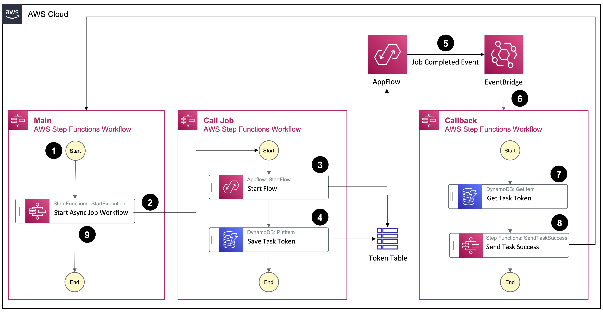

# Building asynchronous workflows without polling for state changes

[AWS Step Functions](https://docs.aws.amazon.com/step-functions/latest/dg/welcome.html) integrates with AWS services, letting you call service API actions from your workflow. For selected long running service actions it can wait for its completion.

But what if your service is not part of these optimized integrations and you still want to wait for a long running job to complete state before continuing with your next task in your workflow? 

This project shows a solution that starts a long running job and then listens to job state changes in [Amazon EventBridge](https://docs.aws.amazon.com/eventbridge/latest/userguide/eb-what-is.html) and only continues when the job reaches a desired state. 

# Solution Architecture



[This blog](https://aws.amazon.com/blogs) exaplains the solution architecutre in detail.

# Deployment

## Prerequisites

- An AWS account with permissions to create AWS resources
- AWS [CDK Toolkit](https://docs.aws.amazon.com/cdk/v2/guide/cli.html) installed and setup
- AWS environment [bootstrapped](https://docs.aws.amazon.com/cdk/v2/guide/bootstrapping.html) for CDK deployment

## Deployment 

To deploy this stack to your default AWS account/region, run:

```
cdk deploy
```

# Solution Implementation

Deployment creates following resources in your AWS account:

## Amazon DynamoDB Token Table

DynamoDB table `TaskTokens` storing execution ID of submitted jobs and the corresponding task tokens.

## Amazon AppFlow Flow

AppFlow flow `${stackName}-example-flow` which simply maps JSON files from the example bucket's input prefix to the output prefix without any transformation. This flow is solely an example flow to demonstrate the asynchronous workflow pattern.

## Amazon Simple Storage Service (Amazon S3) Bucket

Amazon S3 bucket holding a simple JSON file to be used in the AppFlow flow. 

## Main AWS Step Functions Workflow

The primary / main workflow `${this.stackName}-main` orchestrates the start of the asynchronous job. Instead of calling the job API directly, this workflow calls a nested workflow with the **Wait For Callback** integration pattern. A task token is automatically created by Step Functions service and passed to the nested workflow. The primary workflow then waits until a task token is sent back. 

## Nested AWS Step Functions Workflow
The nested workflow `${stackName}-call-job` starts the AppFlow flow with the standard **Request Response** integration pattern. The job request returns synchronously with the execution ID of the job (i.e. flow). In the next step, it stores the execution ID with the task token that has been passed as input from the main flow in the DynamoDB table. 

## Success Callback AWS Step Functions Workflow
After successful job completion, an event is sent to Amazon EventBridge. EventBridge routes the event with the execution ID and the status of the job to this workflow `${stackName}-callback`. It fetches the corresponding task token given the execution ID from the DynamoDB table and returns it to AWS Step Functions. 

# Cleanup

To avoid incurring future charges, delete the resources created after deployment.

```
cdk destroy
```

# License

This library is licensed under the MIT-0 License. See the LICENSE file.